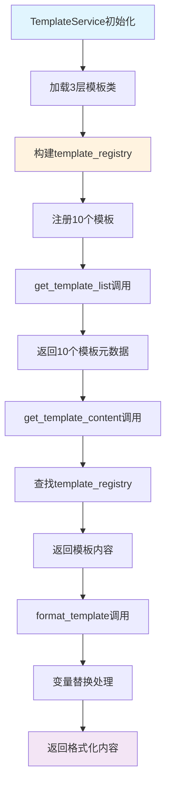
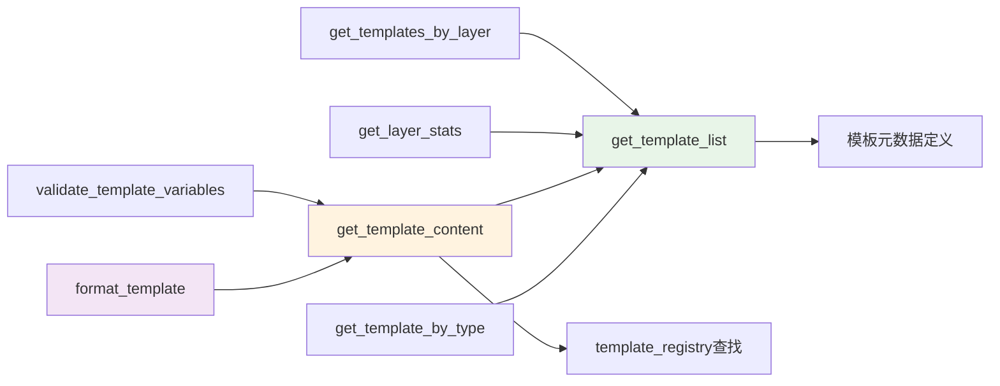

# 文件分析报告：src/templates/document_templates.py

## 文件概述

**文件路径**: `/src/templates/document_templates.py`  
**文件类型**: Python模块  
**主要作用**: CodeLens模板系统的核心管理文件，为Claude Code提供10个专业模板的统一管理服务  
**代码行数**: 313行  
**复杂度**: 高

这个文件是CodeLens模板系统的核心枢纽，实现了TemplateService类，管理3层文档架构（架构层、文件层、项目层）的10个专业模板。它为4阶段文档生成流程提供标准化的模板访问接口，支持智能查询、统计分析和格式化功能。

## 代码结构分析

### 导入依赖
```python
from typing import Dict, List, Any  # 类型注解支持
from ..logging import get_logger  # 日志系统（可选）
from .templates import ArchitectureTemplates, FileTemplates, ProjectTemplates  # 3层模板类
```

### 全局变量和常量
- **DocumentTemplates**: 向后兼容的原版模板集合
- **模板注册表**: 10个核心模板的完整映射
- **日志系统**: 可选的日志记录功能

### 配置和设置
- **3层架构**: Architecture(6) + File(1) + Project(3) = 10个模板
- **模板元数据**: 每个模板包含name, description, type, layer, variables等完整信息

## 函数详细分析

### 函数概览表
| 函数名 | 参数数量 | 返回类型 | 主要功能 |
|--------|----------|----------|----------|
| get_template_list | 0 | List[Dict[str, Any]] | 获取10个模板的完整元数据列表 |
| get_templates_by_layer | 1 | List[Dict[str, Any]] | 按层级过滤模板（architecture/file/project） |
| get_layer_stats | 0 | Dict[str, int] | 统计各层级模板数量分布 |
| get_template_content | 1 | Dict[str, Any] | 获取指定模板的内容和元数据 |
| get_template_by_type | 1 | List[Dict[str, Any]] | 按类型获取模板列表 |
| validate_template_variables | 2 | Dict[str, Any] | 验证模板变量完整性 |
| format_template | 2+ | Dict[str, Any] | 格式化模板内容，支持变量替换 |

### 函数详细说明

**get_template_list()**
- 返回10个核心模板的完整元数据
- 包含架构层6个、文件层1个、项目层3个模板
- 每个模板包含name, description, type, layer, file_path, variables等信息

**get_template_content(template_name)**
- 获取指定模板的完整内容和元数据
- 包含日志记录和错误处理
- 返回success标识和详细模板信息

**validate_template_variables(template_name, variables)**
- 验证提供的变量是否满足模板要求
- 检查缺失变量和多余变量
- 返回详细的验证结果

## 类详细分析

### 类概览表
| 类名 | 继承关系 | 主要属性 | 主要方法 | 核心功能 |
|------|----------|----------|----------|----------|
| DocumentTemplates | - | 4个兼容性模板 | - | 向后兼容性支持 |
| TemplateService | - | template_registry, logger, 3个模板实例 | 7个核心方法 | 10模板统一管理 |

### 类详细说明

**TemplateService类**
- **核心属性**：
  - `template_registry`: 10个模板的完整映射字典
  - `arch_templates`: 架构层模板实例（6个模板）
  - `file_templates`: 文件层模板实例（1个模板）
  - `project_templates`: 项目层模板实例（3个模板）
- **设计模式**: 服务层模式，统一管理模板资源
- **关键特性**: 智能查询、统计分析、格式化、变量验证

## 函数调用流程图



## 变量作用域分析

| 变量类型 | 作用域 | 生命周期 | 访问权限 |
|----------|--------|----------|----------|
| template_registry | 实例属性 | 对象生命周期 | public |
| arch_templates | 实例属性 | 对象生命周期 | public |
| file_templates | 实例属性 | 对象生命周期 | public |
| project_templates | 实例属性 | 对象生命周期 | public |
| logger | 实例属性 | 对象生命周期 | public |
| template_info | 局部变量 | 方法执行期间 | private |

## 函数依赖关系



### 在4阶段文档生成系统中的作用

1. **Phase 1 (项目扫描)**: 提供项目扫描相关模板，支持项目分析文档生成
2. **Phase 2 (文件分析)**: 提供file_summary模板，支持详细文件分析文档
3. **Phase 3 (架构分析)**: 提供6种架构模板（architecture, tech_stack, data_flow等）
4. **Phase 4 (项目文档)**: 提供3种项目模板（README, changelog, roadmap）

**核心价值**:
- **统一入口**: 为所有MCP工具提供标准化的模板访问接口
- **3层架构**: 完整实现架构层、文件层、项目层的模板体系
- **智能管理**: 支持按层级、类型、名称的多维度模板查询
- **质量保障**: 提供变量验证和格式化功能，确保文档质量
- **扩展性**: 模块化设计支持未来模板系统的扩展

**模板分布**:
- **架构层**: 6个模板（overview, tech_stack, data_flow, system_architecture, component_diagram, deployment_diagram）
- **文件层**: 1个综合模板（file_summary，包含流程图、变量作用域、函数依赖分析）
- **项目层**: 3个模板（README, changelog, roadmap）

这是整个CodeLens系统的"模板大脑"，为4阶段文档生成流程提供丰富、专业、标准化的文档模板资源，确保生成的文档具有一致的高质量和专业性。