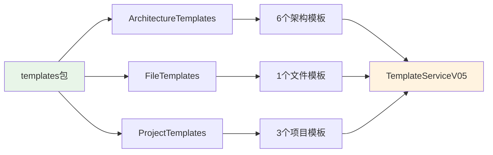

# 文件分析报告：src/templates/templates/__init__.py

## 文件概述

**文件路径**: `/src/templates/templates/__init__.py`  
**文件类型**: Python包初始化文件  
**主要作用**: 3层模板系统的统一导出文件，为CodeLens的10个核心模板提供统一的访问入口  
**代码行数**: 14行  
**复杂度**: 简单

这个文件是CodeLens模板系统的统一导出文件，整合了Architecture、File、Project三层模板类，实现模板系统的模块化组织和统一管理。它为4阶段文档生成系统提供了清晰的模板架构基础。

## 代码结构分析

### 导入依赖
```python
from .architecture_templates import ArchitectureTemplates  # 架构层模板类（6个模板）
from .file_templates import FileTemplates  # 文件层模板类（1个模板）
from .project_templates import ProjectTemplates  # 项目层模板类（3个模板）
```

### 全局变量和常量
- **__all__**: 定义公开接口列表，确保导入的一致性
- **文档字符串**: 说明三层架构文档模板系统的设计理念

### 配置和设置
- **3层架构**: Architecture(6) + File(1) + Project(3) = 10个模板
- **统一导出**: 通过__all__明确定义公开接口

## 函数详细分析

### 函数概览表
| 函数名 | 参数数量 | 返回类型 | 主要功能 |
|--------|----------|----------|----------|
| 无函数 | - | - | - |

### 函数详细说明
本文件不包含任何函数定义，主要功能是模块导入和导出。

## 类详细分析

### 类概览表
| 类名 | 继承关系 | 主要属性 | 主要方法 | 核心功能 |
|------|----------|----------|----------|----------|
| 无直接定义类 | - | - | - | 导入和导出外部模板类 |

### 类详细说明
本文件通过导入导出机制，使以下三个模板类可被统一访问：
- **ArchitectureTemplates**: 提供6种架构层文档模板
- **FileTemplates**: 提供1种文件层综合分析模板
- **ProjectTemplates**: 提供3种项目层文档模板

## 函数调用流程图

```mermaid
graph TD
    A[包导入请求] --> B[/__init__.py加载]
    B --> C[导入ArchitectureTemplates]
    B --> D[导入FileTemplates]
    B --> E[导入ProjectTemplates]
    C --> F[6个架构模板可用]
    D --> G[1个文件模板可用]
    E --> H[3个项目模板可用]
    F --> I[统一模板访问接口]
    G --> I
    H --> I
    
    style B fill:#e1f5fe
    style I fill:#f3e5f5
```

## 变量作用域分析

| 变量类型 | 作用域 | 生命周期 | 访问权限 |
|----------|--------|----------|----------|
| __all__ | 模块级 | 模块生命周期 | public |
| 导入的类 | 模块级 | 模块生命周期 | public |

## 函数依赖关系



### 在4阶段文档生成系统中的作用

1. **Phase 1 (项目扫描)**: 为模板系统提供统一的模板类访问入口
2. **Phase 2 (文件分析)**: 支持FileTemplates的统一访问，提供文件分析模板
3. **Phase 3 (架构分析)**: 支持ArchitectureTemplates的统一访问，提供6种架构模板
4. **Phase 4 (项目文档)**: 支持ProjectTemplates的统一访问，提供3种项目模板

**核心价值**:
- **统一入口**: 为TemplateServiceV05提供3层模板类的统一导入
- **模块化架构**: 实现10个核心模板的分层组织
- **清晰分离**: 每个模板类专注于特定文档层级
- **易于维护**: 独立文件便于代码审查和维护
- **扩展性**: 新增模板层级只需添加相应导入

**模板系统架构**:
- **架构层**: 6个模板（33%）- 系统概述、技术栈、数据流等
- **文件层**: 1个模板（10%）- 综合文件分析模板
- **项目层**: 3个模板（30%）- README、变更日志、路线图
- **总计**: 10个核心模板（100%）

**设计原则**:
- **分层组织**: 按文档层级和功能范围组织模板
- **独立维护**: 每层模板类独立管理，便于维护和扩展
- **统一接口**: 通过统一导出提供一致的访问方式

这个文件虽然简单，但在CodeLens模板系统中起到关键的"桥梁"作用，连接3层模板架构与统一的模板服务，确保整个文档生成系统的模块化和可维护性。