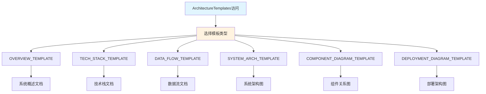
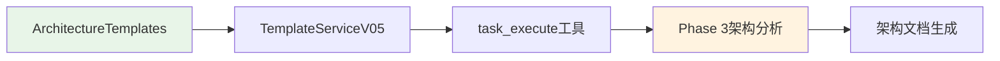

# 文件分析报告：src/templates/templates/architecture_templates.py

## 文件概述

**文件路径**: `/src/templates/templates/architecture_templates.py`  
**文件类型**: Python模块  
**主要作用**: CodeLens架构层模板集合，提供6个专业的架构级文档模板  
**代码行数**: 约600行  
**复杂度**: 高

这个文件实现了ArchitectureTemplates类，为系统架构、技术栈、数据流、组件图等核心架构文档提供标准化模板，是3层文档架构中架构层的完整实现。它在Phase 3阶段发挥关键作用，支持6种不同类型的架构文档生成。

## 代码结构分析

### 导入依赖
无外部导入，纯模板字符串定义

### 全局变量和常量
- **6个架构模板常量**: OVERVIEW_TEMPLATE, TECH_STACK_TEMPLATE等
- **模板变量**: 每个模板包含特定的变量占位符

### 配置和设置
- **模板格式**: 使用Python字符串格式化语法（{variable}）
- **文档结构**: 每个模板都包含标准的Markdown结构

## 函数详细分析

### 函数概览表
| 函数名 | 参数数量 | 返回类型 | 主要功能 |
|--------|----------|----------|----------|
| 无函数 | - | - | - |

### 函数详细说明
本文件不包含任何函数定义，主要是模板字符串的定义。

## 类详细分析

### 类概览表
| 类名 | 继承关系 | 主要属性 | 主要方法 | 核心功能 |
|------|----------|----------|----------|----------|
| ArchitectureTemplates | - | 6个模板常量 | - | 架构模板容器 |

### 类详细说明

**ArchitectureTemplates类**
- **核心属性**: 6个架构层模板常量
  - `OVERVIEW_TEMPLATE`: 系统概述模板
  - `TECH_STACK_TEMPLATE`: 技术栈模板
  - `DATA_FLOW_TEMPLATE`: 数据流模板
  - `SYSTEM_ARCH_TEMPLATE`: 系统架构图模板
  - `COMPONENT_DIAGRAM_TEMPLATE`: 组件图模板
  - `DEPLOYMENT_DIAGRAM_TEMPLATE`: 部署图模板
- **设计模式**: 容器模式，提供模板资源的统一访问

## 函数调用流程图

## 变量作用域分析

| 变量类型 | 作用域 | 生命周期 | 访问权限 |
|----------|--------|----------|----------|
| 模板常量 | 类级别 | 类生命周期 | public |
| 模板变量 | 模板内部 | 格式化期间 | template-scope |

## 函数依赖关系

本文件主要是静态模板定义，不存在复杂的函数依赖关系，但与以下组件协作：

### 在4阶段文档生成系统中的作用

1. **Phase 1 (项目扫描)**: 暂不参与
2. **Phase 2 (文件分析)**: 暂不参与
3. **Phase 3 (架构分析)**: 核心作用阶段，提供6种架构文档模板
4. **Phase 4 (项目文档)**: 为项目文档提供架构相关内容引用

**核心价值**:
- **6种架构视图**: 从不同角度展现系统架构
- **标准化格式**: 确保架构文档的一致性和专业性
- **变量化设计**: 支持不同项目的个性化定制
- **Mermaid图表**: 内置图表支持，提供可视化架构展示

**模板类型详解**:
- **概述模板**: 系统整体架构和设计原则
- **技术栈模板**: 详细的技术选型和架构原则
- **数据流模板**: 系统数据流转和处理流程
- **系统架构图**: 可视化的系统架构图表
- **组件图**: 组件关系和依赖结构
- **部署图**: 部署架构和环境配置

这是CodeLens系统在Phase 3阶段的核心模板资源，为复杂系统提供完整的架构文档支持。