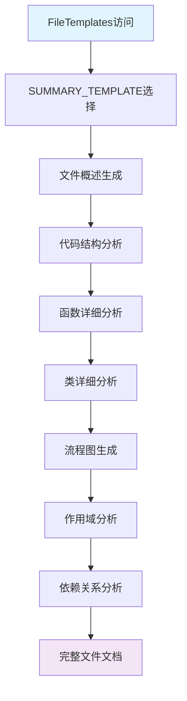
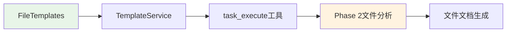

# 文件分析报告：src/templates/templates/file_templates.py

## 文件概述

**文件路径**: `/src/templates/templates/file_templates.py`  
**文件类型**: Python模块  
**主要作用**: CodeLens文件层模板集合，提供1个综合的文件级文档模板  
**代码行数**: 约200行  
**复杂度**: 中等

这个文件实现了FileTemplates类，提供了综合的文件分析模板，整合了文件摘要、类分析和函数目录功能，专注于单个文件的完整文档生成。它是3层文档架构中文件层的核心实现，在Phase 2阶段发挥关键作用。

## 代码结构分析

### 导入依赖
无外部导入，纯模板字符串定义

### 全局变量和常量
- **SUMMARY_TEMPLATE**: 综合文件分析模板常量
- **模板变量**: 包含文件分析所需的20+个变量占位符

### 配置和设置
- **模板格式**: 使用Python字符串格式化语法（{variable}）
- **文档结构**: 遵循新的8章节标准化结构

## 函数详细分析

### 函数概览表
| 函数名 | 参数数量 | 返回类型 | 主要功能 |
|--------|----------|----------|----------|
| 无函数 | - | - | - |

### 函数详细说明
本文件不包含任何函数定义，主要是文件分析模板字符串的定义。

## 类详细分析

### 类概览表
| 类名 | 继承关系 | 主要属性 | 主要方法 | 核心功能 |
|------|----------|----------|----------|----------|
| FileTemplates | - | 1个模板常量 | - | 文件模板容器 |

### 类详细说明

**FileTemplates类**
- **核心属性**: 
  - `SUMMARY_TEMPLATE`: 综合文件分析模板，包含8个标准章节
- **设计模式**: 容器模式，提供文件层模板资源的统一访问
- **模板结构**: 
  1. 文件分析报告标题
  2. 文件概述
  3. 代码结构分析
  4. 函数详细分析  
  5. 类详细分析
  6. 函数调用流程图
  7. 变量作用域分析
  8. 函数依赖关系

## 函数调用流程图

## 变量作用域分析

| 变量类型 | 作用域 | 生命周期 | 访问权限 |
|----------|--------|----------|----------|
| SUMMARY_TEMPLATE | 类级别 | 类生命周期 | public |
| 模板变量 | 模板内部 | 格式化期间 | template-scope |

## 函数依赖关系

本文件主要是静态模板定义，与以下组件协作：

### 在4阶段文档生成系统中的作用

1. **Phase 1 (项目扫描)**: 暂不参与
2. **Phase 2 (文件分析)**: 核心作用阶段，提供文件分析模板
3. **Phase 3 (架构分析)**: 为架构分析提供文件级别的详细信息
4. **Phase 4 (项目文档)**: 为项目文档提供代码质量和文件结构信息

**核心价值**:
- **综合分析**: 单个模板涵盖文件的所有重要方面
- **标准化格式**: 确保所有文件文档的一致性和专业性
- **详细程度**: 包含函数、类、变量、依赖等完整信息
- **可视化支持**: 内置流程图和依赖关系图

**模板章节详解**:
- **文件概述**: 文件基本信息、主要作用、复杂度评估
- **代码结构**: 导入依赖、全局变量、配置设置分析
- **函数分析**: 函数概览表和详细说明
- **类分析**: 类概览表和详细说明
- **流程图**: Mermaid格式的函数调用流程图
- **作用域分析**: 变量作用域和生命周期分析
- **依赖关系**: 函数和模块间的依赖关系图

这是CodeLens系统在Phase 2阶段的核心模板资源，为每个源文件提供完整、专业的分析文档，确保代码级文档的高质量和一致性。