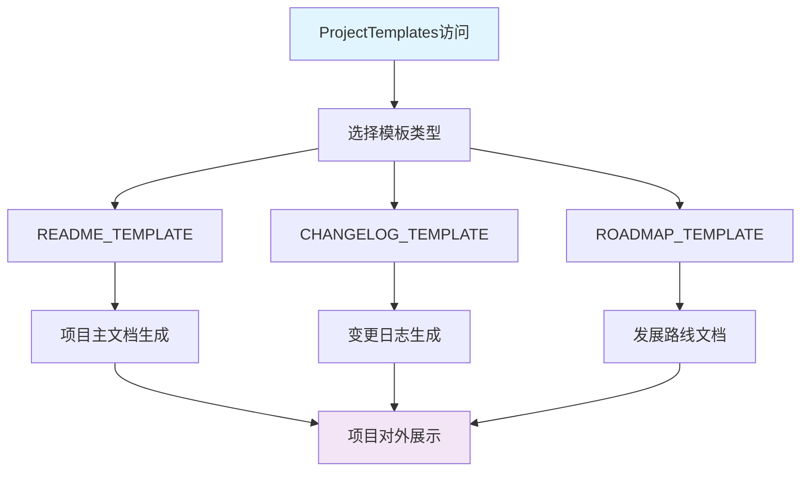
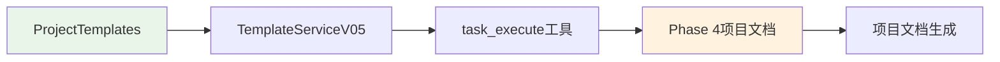

# 文件分析报告：src/templates/templates/project_templates.py

## 文件概述

**文件路径**: `/src/templates/templates/project_templates.py`  
**文件类型**: Python模块  
**主要作用**: CodeLens项目层模板集合，提供3个核心的项目级文档模板  
**代码行数**: 约400行  
**复杂度**: 中等

这个文件实现了ProjectTemplates类，为项目README、变更日志、发展路线等核心项目文档提供标准化模板，是3层文档架构中项目层的完整实现。它在Phase 4阶段发挥关键作用，支持项目整体文档和管理相关的模板化生成。

## 代码结构分析

### 导入依赖
无外部导入，纯模板字符串定义

### 全局变量和常量
- **3个项目模板常量**: README_TEMPLATE, CHANGELOG_TEMPLATE, ROADMAP_TEMPLATE
- **模板变量**: 每个模板包含特定的项目信息变量占位符

### 配置和设置
- **模板格式**: 使用Python字符串格式化语法（{variable}）
- **文档结构**: 每个模板都包含标准的项目文档结构

## 函数详细分析

### 函数概览表
| 函数名 | 参数数量 | 返回类型 | 主要功能 |
|--------|----------|----------|----------|
| 无函数 | - | - | - |

### 函数详细说明
本文件不包含任何函数定义，主要是项目文档模板字符串的定义。

## 类详细分析

### 类概览表
| 类名 | 继承关系 | 主要属性 | 主要方法 | 核心功能 |
|------|----------|----------|----------|----------|
| ProjectTemplates | - | 3个模板常量 | - | 项目模板容器 |

### 类详细说明

**ProjectTemplates类**
- **核心属性**: 3个项目层模板常量
  - `README_TEMPLATE`: 项目主文档模板
  - `CHANGELOG_TEMPLATE`: 变更日志模板
  - `ROADMAP_TEMPLATE`: 发展路线模板
- **设计模式**: 容器模式，提供项目层模板资源的统一访问

## 函数调用流程图

## 变量作用域分析

| 变量类型 | 作用域 | 生命周期 | 访问权限 |
|----------|--------|----------|----------|
| 模板常量 | 类级别 | 类生命周期 | public |
| 模板变量 | 模板内部 | 格式化期间 | template-scope |

## 函数依赖关系

本文件主要是静态模板定义，与以下组件协作：

### 在4阶段文档生成系统中的作用

1. **Phase 1 (项目扫描)**: 暂不参与
2. **Phase 2 (文件分析)**: 暂不参与
3. **Phase 3 (架构分析)**: 为项目文档提供架构信息引用
4. **Phase 4 (项目文档)**: 核心作用阶段，提供3种项目文档模板

**核心价值**:
- **对外展示**: 为项目提供专业的对外展示文档
- **版本管理**: 提供结构化的变更追踪和版本规划
- **标准化格式**: 确保项目文档的专业性和一致性
- **完整覆盖**: 涵盖项目介绍、变更历史、未来规划等关键信息

**模板类型详解**:
- **README模板**: 
  - 项目概述和核心特性
  - 环境要求和快速开始指南
  - 技术架构和使用示例
  - 贡献指南和许可证信息
- **CHANGELOG模板**:
  - 版本变更记录
  - 结构化的更新日志格式
  - 功能增加、修复、改进的分类记录
- **ROADMAP模板**:
  - 总体目标和版本规划
  - 长期愿景和技术演进
  - 社区建设和发展方向

这是CodeLens系统在Phase 4阶段的核心模板资源，为项目提供完整、专业的对外展示文档，确保项目形象的统一性和专业性。