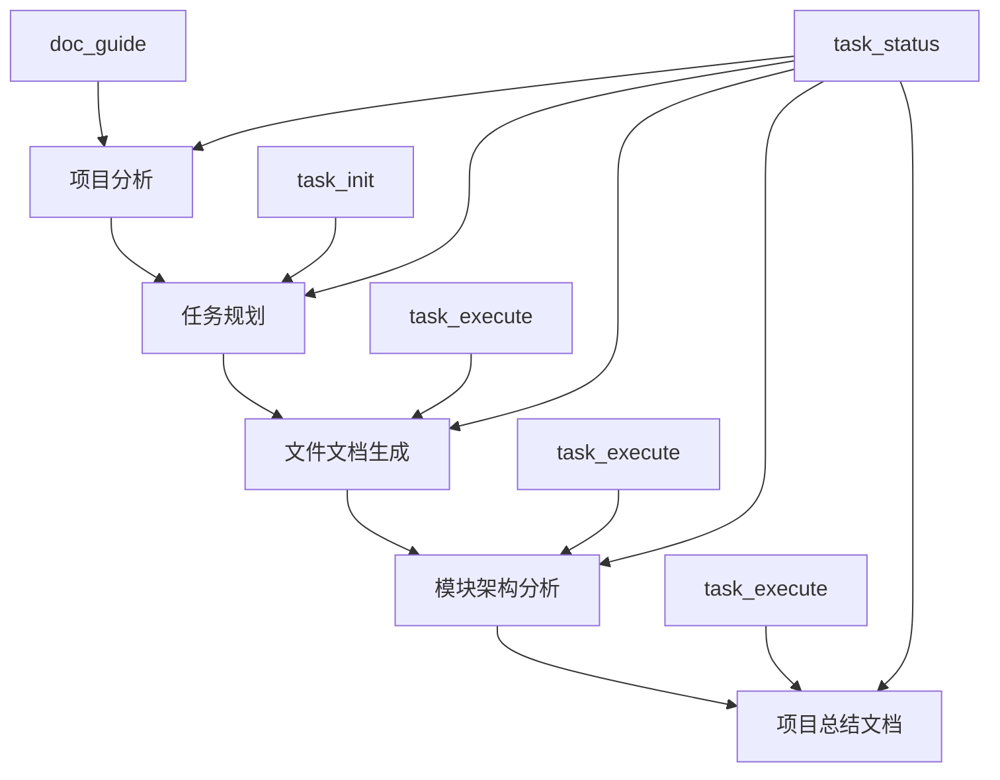

# Task Engine 业务流程

## 整体工作流程

### 5阶段执行流程图


## 阶段1: 项目分析流程

### 流程步骤
1. **项目路径输入**: 接收项目路径参数
2. **智能扫描**: 使用doc_guide工具分析项目结构
3. **项目类型检测**: 识别Python/JavaScript/Java/Go/Rust等项目类型
4. **框架识别**: 检测Flask/Django/React/Vue/Spring等框架
5. **文档策略生成**: 基于项目特征生成定制化文档策略

### 数据流
```
项目路径 → ProjectAnalyzer → 项目特征分析 → 文档策略 → JSON输出
```

### 任务创建
- 创建1个扫描任务 (task_type: SCAN)
- 任务状态: PENDING → IN_PROGRESS → COMPLETED
- 输出: 项目分析结果、文档策略、生成计划

### 完成条件
- 扫描任务完成率: 100%
- 项目分析结果完整
- 文档策略生成成功

## 阶段2: 任务规划流程

### 流程步骤
1. **分析数据输入**: 接收阶段1的项目分析结果
2. **任务生成**: 使用task_init工具生成完整任务列表
3. **依赖图构建**: 构建任务间的依赖关系图谱
4. **优先级排序**: 基于依赖关系和重要性排序
5. **执行计划制定**: 生成详细的执行计划和时间估算

### 数据流
```
分析结果 → TaskPlanGenerator → 任务列表 → 依赖图 → 执行计划
```

### 任务创建
- 根据项目规模创建20-30个任务
- 任务类型: FILE_SUMMARY, MODULE_ANALYSIS, ARCHITECTURE等
- 依赖关系: 自动构建任务间依赖图谱

### 完成条件
- 所有任务创建成功
- 依赖图构建完整
- 无循环依赖检测通过

## 阶段3: 文件文档生成流程

### 流程步骤
1. **核心文件识别**: 基于项目分析确定核心文件列表
2. **任务执行**: 使用task_execute工具执行文件文档任务
3. **模板匹配**: 为每个文件选择合适的文档模板
4. **内容生成**: 生成详细的文件摘要文档
5. **状态跟踪**: 实时跟踪文件文档生成进度

### 数据流
```
核心文件列表 → TaskExecutor → 模板获取 → 内容生成 → 文档输出
```

### 任务执行模式
- **prepare模式**: 准备任务执行上下文
- **execute模式**: 执行任务并更新状态
- **complete模式**: 标记任务完成并记录结果

### 完成条件
- 所有文件文档任务完成率: 100%
- 核心文件文档生成成功
- 无任务失败或阻塞

## 阶段4: 模块架构分析流程

### 流程步骤
1. **模块识别**: 基于文件分析结果识别功能模块
2. **关系映射**: 分析模块间的依赖关系和接口
3. **架构设计**: 生成系统架构图和组件图
4. **技术栈分析**: 详细分析项目使用的技术栈
5. **文档生成**: 生成架构层面的技术文档

### 数据流
```
模块列表 → 关系分析 → 架构设计 → 技术栈分析 → 架构文档
```

### 任务类型
- MODULE_ANALYSIS: 模块功能分析
- MODULE_RELATIONS: 模块关系映射
- DEPENDENCY_GRAPH: 依赖图谱生成
- ARCHITECTURE: 系统架构文档
- TECH_STACK: 技术栈分析

### 完成条件
- 架构类任务完成率: 100%
- 系统架构文档完整
- 技术栈分析准确

## 阶段5: 项目总结流程

### 流程步骤
1. **整体梳理**: 汇总前4个阶段的所有文档
2. **README生成**: 生成项目主README文档
3. **项目完整性验证**: 验证文档体系完整性
4. **质量检查**: 检查文档质量和一致性
5. **最终输出**: 生成完整的项目文档体系

### 数据流
```
所有文档 → 整体分析 → README生成 → 完整性验证 → 最终输出
```

### 任务执行
- PROJECT_README: 生成项目README文档
- 集成验证: 检查文档体系完整性
- 质量保证: 确保文档质量标准

### 完成条件
- 项目README生成成功
- 文档体系完整性验证通过
- 质量检查无异常

## 严格阶段控制机制

### 阶段依赖关系
```
阶段1 (扫描) → 阶段2 (规划) → 阶段3 (文件) → 阶段4 (架构) → 阶段5 (项目)
```

### 进度门控规则
1. **100%完成率要求**: 每阶段必须达到100%任务完成率
2. **依赖验证**: 检查所有前置阶段依赖是否满足
3. **质量检查**: 验证阶段输出质量是否符合标准
4. **错误处理**: 处理任务失败和异常情况

### 阶段转换流程
```python
# 阶段转换检查
if phase_controller.can_proceed_to_next_phase(current_phase):
    # 允许进入下一阶段
    next_phase = phase_controller.get_next_phase(current_phase)
    phase_controller.start_phase(next_phase)
else:
    # 阻塞，需要完成当前阶段所有任务
    pending_tasks = task_manager.get_pending_tasks(current_phase)
    return {"blocked": True, "pending_tasks": pending_tasks}
```

## 状态持久化流程

### 数据存储结构
```
.codelens/
├── tasks.json          # 任务状态数据
├── task_events.json    # 任务事件历史
└── state_snapshots.json # 状态快照
```

### 状态同步机制
1. **实时保存**: 每次状态变更立即持久化
2. **原子操作**: 确保文件写入的原子性
3. **事件记录**: 记录所有任务状态变更事件
4. **快照机制**: 定期创建状态快照用于恢复

### 异常恢复流程
```python
# 系统启动时恢复状态
try:
    state_tracker.load_state()
    task_manager.restore_from_state()
    phase_controller.restore_phase_state()
except StateCorruptionError:
    # 从最近的快照恢复
    state_tracker.restore_from_snapshot()
```

## 性能监控流程

### 实时监控指标
- **任务执行时间**: 记录每个任务的执行耗时
- **阶段进度**: 实时计算各阶段完成进度
- **系统资源**: 监控内存和CPU使用情况
- **错误率**: 统计任务失败率和错误类型

### 健康检查流程
```python
def health_check():
    checks = [
        check_task_manager_health(),
        check_phase_controller_health(),
        check_state_tracker_health(),
        check_file_system_health()
    ]
    
    overall_health = "good" if all(checks) else "warning"
    return {"overall_health": overall_health, "checks": checks}
```

### 性能优化策略
1. **并发执行**: 独立任务可并发执行
2. **缓存机制**: 缓存频繁访问的数据
3. **延迟加载**: 按需加载任务详情
4. **批量操作**: 批量更新状态减少I/O

## 错误处理流程

### 错误类型分类
- **任务执行错误**: 任务执行过程中的异常
- **依赖关系错误**: 任务依赖关系不满足
- **阶段控制错误**: 阶段转换条件不满足
- **状态持久化错误**: 文件读写异常

### 错误恢复策略
1. **自动重试**: 临时性错误自动重试3次
2. **降级处理**: 非关键错误继续执行其他任务
3. **人工干预**: 严重错误提示人工干预
4. **状态回滚**: 必要时回滚到最近的稳定状态

### 错误报告格式
```json
{
    "error_type": "TaskExecutionError",
    "error_message": "File not found: /path/to/file.py",
    "task_id": "task_123",
    "phase": "phase_2_files",
    "timestamp": "2025-09-13T10:30:00Z",
    "recovery_suggestion": "Check if file exists and is accessible"
}
```

## 最佳实践建议

### 任务设计原则
1. **单一职责**: 每个任务只负责一个具体功能
2. **明确依赖**: 清晰定义任务间的依赖关系
3. **可测试性**: 任务应该可以独立测试
4. **幂等性**: 任务重复执行结果一致

### 阶段控制建议
1. **严格验证**: 不跳过任何验证步骤
2. **完整性检查**: 确保每阶段输出完整
3. **质量保证**: 验证文档质量符合标准
4. **进度透明**: 实时显示执行进度

### 状态管理建议
1. **及时持久化**: 重要状态变更立即保存
2. **备份机制**: 定期创建状态备份
3. **清理策略**: 定期清理过期的历史数据
4. **监控告警**: 状态异常时及时告警