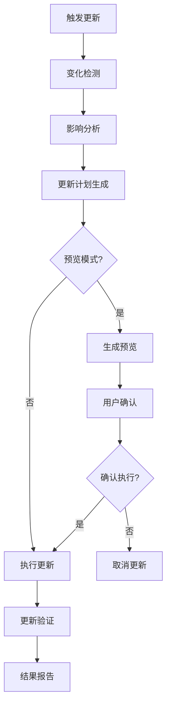

# CodeLens AI工具设计方案

## 概述

本文档设计两个核心AI辅助工具，用于提升CodeLens项目的AI协作体验和文档维护效率：

1. **project_overview工具** - AI快速项目理解工具
2. **doc_update工具** - 智能文档更新工具

## 1. project_overview工具设计

### 1.1 工具概述

**目标**: 让AI快速、全面地了解CodeLens项目的完整信息
**核心功能**: 自动读取并整合docs/architecture和docs/project文件夹中的所有文档内容

### 1.2 技术设计

#### 文件结构
```
src/mcp_tools/project_overview.py
├── ProjectOverviewCore     # 核心业务逻辑
├── ProjectOverviewTool     # MCP工具封装
└── create_mcp_tool()       # 工厂函数
```

#### 核心功能设计

```python
class ProjectOverviewCore:
    def __init__(self, project_path):
        self.project_path = Path(project_path)
        self.docs_path = self.project_path / "docs"
        self.logger = get_logger(component="project_overview")
    
    def generate_overview(self, mode="complete", include_files=True):
        """
        生成项目概览
        mode: "summary" | "complete" | "architecture" | "project"
        include_files: 是否包含文件级详细信息
        """
        overview = {
            "project_info": self._get_project_basic_info(),
            "architecture": self._read_architecture_docs(),
            "project_docs": self._read_project_docs(), 
            "structure_summary": self._generate_structure_summary(),
            "key_insights": self._extract_key_insights(),
            "quick_start": self._get_quick_start_info()
        }
        return overview
```

#### 输出结构设计

```json
{
    "success": true,
    "overview": {
        "project_info": {
            "name": "CodeLens",
            "type": "智能文档协作平台",
            "architecture": "五层架构设计",
            "core_features": ["Task Engine", "热重载系统", "7个专业MCP工具"]
        },
        "architecture": {
            "overview": "系统架构概述内容...",
            "tech_stack": "技术栈详细信息...",
            "data_flow": "数据流设计...",
            "components": "组件关系图...",
            "deployment": "部署架构..."
        },
        "project_docs": {
            "readme": "项目README内容...",
            "changelog": "变更日志...",
            "roadmap": "发展路线图..."
        },
        "structure_summary": {
            "layers": ["MCP接口层", "任务引擎层", "热重载系统层", "服务层", "基础设施层"],
            "tools": 7,
            "templates": 16,
            "phases": 5
        },
        "key_insights": [
            "CodeLens是智能化任务驱动MCP服务器",
            "支持5阶段严格控制工作流",
            "具备完整的热重载系统",
            "提供14种任务类型管理"
        ],
        "quick_start": {
            "requirements": ["Python 3.9+", "无外部依赖"],
            "installation": "git clone + python mcp_server.py",
            "basic_usage": ["启动服务器", "测试工具", "集成Claude Code"]
        }
    },
    "metadata": {
        "generated_at": "2025-09-15T10:30:00Z",
        "docs_read": 12,
        "content_length": 15420
    }
}
```

### 1.3 MCP工具配置

```python
def get_tool_definition(self):
    return {
        "name": "project_overview",
        "description": "快速生成CodeLens项目的完整概览，帮助AI理解项目架构、功能和使用方法",
        "inputSchema": {
            "type": "object",
            "properties": {
                "project_path": {
                    "type": "string",
                    "description": "CodeLens项目根路径"
                },
                "mode": {
                    "type": "string",
                    "enum": ["summary", "complete", "architecture", "project"],
                    "description": "概览模式：summary(摘要), complete(完整), architecture(仅架构), project(仅项目文档)",
                    "default": "complete"
                },
                "include_files": {
                    "type": "boolean", 
                    "description": "是否包含文件级详细信息",
                    "default": true
                },
                "format": {
                    "type": "string",
                    "enum": ["structured", "markdown", "plain"],
                    "description": "输出格式",
                    "default": "structured"
                }
            },
            "required": ["project_path"]
        }
    }
```

## 2. doc_update工具设计

### 2.1 工具概述

**目标**: 智能检测并更新项目文档，保持文档与代码的同步性
**核心功能**: 分析代码变化，智能更新相关文档内容

### 2.2 技术设计

#### 更新策略矩阵

| 变化类型 | 检测方法 | 更新目标 | 更新策略 |
|----------|----------|----------|----------|
| 新增MCP工具 | 文件扫描 | README.md, 架构文档 | 自动添加工具描述 |
| 修改核心类 | 代码分析 | 相关文件文档 | 更新类说明和方法 |
| 版本升级 | 版本文件 | CHANGELOG.md | 添加版本记录 |
| 配置变更 | 配置文件 | README.md | 更新配置示例 |
| 架构调整 | 结构分析 | 架构文档 | 重新生成架构图 |

#### 核心功能设计

```python
class DocUpdateCore:
    def __init__(self, project_path):
        self.project_path = Path(project_path)
        self.file_service = FileService()
        self.template_service = TemplateService()
        self.logger = get_logger(component="doc_update")
    
    def analyze_update_needs(self):
        """分析哪些文档需要更新"""
        return {
            "code_changes": self._detect_code_changes(),
            "structure_changes": self._detect_structure_changes(),
            "config_changes": self._detect_config_changes(),
            "version_changes": self._detect_version_changes()
        }
    
    def generate_update_plan(self, analysis_result):
        """生成文档更新计划"""
        plan = {
            "updates": [],
            "priority": "high|medium|low",
            "estimated_time": "预估时间",
            "dependencies": "依赖关系"
        }
        return plan
    
    def execute_updates(self, update_plan, mode="preview"):
        """执行文档更新"""
        # mode: "preview" | "execute" | "auto"
        results = []
        for update in update_plan["updates"]:
            result = self._execute_single_update(update, mode)
            results.append(result)
        return results
```

### 2.3 更新类型设计

#### 2.3.1 自动更新类型

```python
AUTO_UPDATE_TYPES = {
    "tool_list": {
        "trigger": "新增/删除MCP工具文件",
        "target": ["README.md", "docs/architecture/overview.md"],
        "method": "parse_mcp_tools() -> update_tool_sections()"
    },
    "version_info": {
        "trigger": "version.py或__version__变化", 
        "target": ["README.md", "docs/project/CHANGELOG.md"],
        "method": "extract_version() -> update_version_refs()"
    },
    "config_examples": {
        "trigger": "配置文件或环境变量变化",
        "target": ["README.md"],
        "method": "parse_configs() -> update_config_sections()"
    },
    "file_count": {
        "trigger": "项目文件结构变化",
        "target": ["README.md", "architecture文档"],
        "method": "count_files() -> update_statistics()"
    }
}
```

#### 2.3.2 智能更新类型

```python
SMART_UPDATE_TYPES = {
    "architecture_sync": {
        "trigger": "核心类或模块结构变化",
        "analysis": "代码结构分析 + 架构文档对比",
        "target": ["docs/architecture/", "docs/files/"],
        "method": "diff_architecture() -> suggest_updates()"
    },
    "feature_sync": {
        "trigger": "新功能或特性添加",
        "analysis": "功能检测 + 文档缺失分析", 
        "target": ["README.md", "项目文档"],
        "method": "detect_features() -> generate_feature_docs()"
    },
    "dependency_sync": {
        "trigger": "依赖关系变化",
        "analysis": "import分析 + 依赖图对比",
        "target": ["架构文档", "技术栈文档"], 
        "method": "analyze_dependencies() -> update_dependency_docs()"
    }
}
```

### 2.4 更新执行引擎

#### 2.4.1 更新流水线



#### 2.4.2 更新模式

```python
UPDATE_MODES = {
    "preview": {
        "description": "预览模式，显示将要进行的更改但不执行",
        "output": "详细的更改预览和影响分析"
    },
    "interactive": {
        "description": "交互模式，逐个确认每个更新",
        "output": "分步执行，用户可选择性确认"
    },
    "auto": {
        "description": "自动模式，执行所有检测到的更新",
        "output": "批量执行，生成更新报告"
    },
    "selective": {
        "description": "选择性模式，只执行指定类型的更新", 
        "output": "按类型过滤执行"
    }
}
```

### 2.5 MCP工具配置

```python
def get_tool_definition(self):
    return {
        "name": "doc_update", 
        "description": "智能检测并更新CodeLens项目文档，保持文档与代码同步",
        "inputSchema": {
            "type": "object",
            "properties": {
                "project_path": {
                    "type": "string",
                    "description": "CodeLens项目根路径"
                },
                "mode": {
                    "type": "string", 
                    "enum": ["preview", "interactive", "auto", "selective"],
                    "description": "更新模式",
                    "default": "preview"
                },
                "update_types": {
                    "type": "array",
                    "items": {
                        "type": "string",
                        "enum": ["tool_list", "version_info", "config_examples", "architecture_sync", "feature_sync", "dependency_sync"]
                    },
                    "description": "指定要检测的更新类型（selective模式下使用）"
                },
                "target_docs": {
                    "type": "array", 
                    "items": {"type": "string"},
                    "description": "指定要更新的目标文档路径"
                },
                "dry_run": {
                    "type": "boolean",
                    "description": "是否为演练模式（不实际修改文件）",
                    "default": true
                }
            },
            "required": ["project_path"]
        }
    }
```

## 3. 集成方案

### 3.1 添加到MCP服务器

```python
# 在mcp_server.py中添加新工具
from src.mcp_tools.project_overview import create_project_overview_tool
from src.mcp_tools.doc_update import create_doc_update_tool

def create_tool_instances():
    return {
        # 现有工具...
        "project_overview": create_project_overview_tool(),
        "doc_update": create_doc_update_tool()
    }
```

### 3.2 工作流集成

#### 与现有5阶段工作流的关系

```
现有5阶段工作流:
Phase 1: init_tools (工作流指导)
Phase 2: doc_guide (项目分析)  
Phase 3: task_init (任务规划)
Phase 4: task_execute (任务执行)
Phase 5: task_status (状态监控)

新增AI辅助工具:
- project_overview: 可在任何阶段快速了解项目状态
- doc_update: 可在阶段4执行完成后进行文档同步更新
```

## 4. 实现优先级

### 4.1 第一阶段 (高优先级)
- ✅ **project_overview工具基础版**
  - 读取docs/architecture和docs/project文件夹
  - 生成结构化概览JSON
  - 支持summary和complete两种模式

### 4.2 第二阶段 (中优先级)  
- 🔄 **doc_update工具基础版**
  - 实现自动更新类型 (tool_list, version_info, config_examples)
  - 支持preview和auto模式
  - 基础的变化检测机制

### 4.3 第三阶段 (扩展功能)
- 🔜 **project_overview工具增强**
  - 添加markdown和plain格式输出
  - 支持architecture和project专项模式
  - 添加项目健康度分析

- 🔜 **doc_update工具增强** 
  - 实现智能更新类型 (architecture_sync, feature_sync)
  - 添加interactive和selective模式
  - 智能代码分析和架构对比

## 5. 使用示例

### 5.1 project_overview工具使用

```bash
# 命令行使用
python src/mcp_tools/project_overview.py /path/to/codelens --mode complete

# Claude Code中使用  
# AI可以调用此工具快速了解整个CodeLens项目
{
    "tool": "project_overview", 
    "args": {
        "project_path": "/path/to/codelens",
        "mode": "complete",
        "format": "structured"
    }
}
```

### 5.2 doc_update工具使用

```bash
# 预览更新 
python src/mcp_tools/doc_update.py /path/to/codelens --mode preview

# 自动更新
python src/mcp_tools/doc_update.py /path/to/codelens --mode auto --dry_run false

# Claude Code中使用
{
    "tool": "doc_update",
    "args": {
        "project_path": "/path/to/codelens", 
        "mode": "preview",
        "update_types": ["tool_list", "version_info"]
    }
}
```

## 6. 预期收益

### 6.1 project_overview工具
- **AI理解效率**: 从需要读取多个文件到一次调用获得完整项目信息
- **上下文完整性**: 提供结构化的项目全貌，避免遗漏关键信息  
- **协作体验**: 大幅提升AI与CodeLens项目的协作效率

### 6.2 doc_update工具
- **文档同步率**: 自动保持文档与代码变化同步，减少人工维护
- **一致性保障**: 确保各文档间信息一致，避免矛盾和过时信息
- **维护效率**: 减少文档维护工作量，专注核心功能开发

这两个工具将显著提升CodeLens项目的AI协作能力和文档维护效率，是对现有5阶段工作流的重要补充和增强。