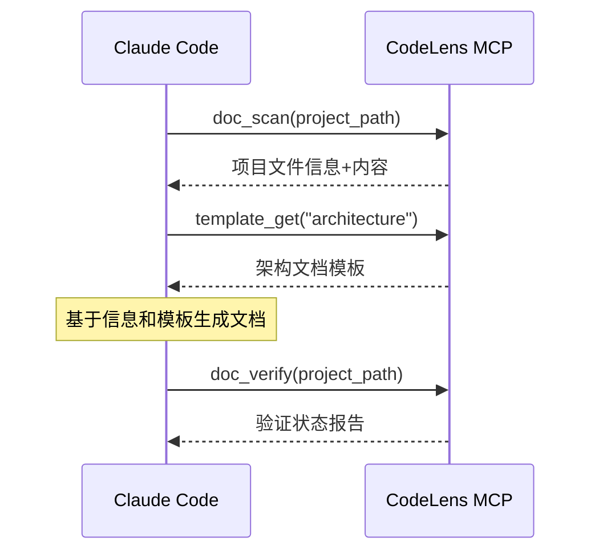

# CodeLens - Claude Code协作助手

## 项目概述

CodeLens 是一个专为Claude Code设计的MCP（Model Context Protocol）协作服务器。它不再执行AI驱动的文档生成，而是专门为Claude Code提供结构化的项目文件信息、标准化的文档模板资源和完整的验证服务，让Claude Code能够高效地理解和生成项目文档。

## 核心特性

- **信息提供优先**：专注于为Claude Code提供结构化的项目信息
- **模板资源服务**：提供标准化的文档模板，支持多种文档类型
- **验证状态报告**：轻量级的文档结构验证，不读取内容
- **MCP协议兼容**：提供标准的MCP工具接口，支持命令行调用
- **企业级日志系统**：完整的本地日志解决方案，支持结构化日志、文件轮转和监控

## 快速开始

### 1. 环境要求

- Python 3.9+
- 无外部依赖，使用Python标准库

### 2. 使用MCP工具

```bash
# 扫描项目文件
python src/mcp_tools/doc_scan.py /path/to/your/project

# 获取文档模板  
python src/mcp_tools/template_get.py --list-all

# 验证文档状态
python src/mcp_tools/doc_verify.py /path/to/your/project
```

### 3. Claude Code协作流程

1. **Claude Code调用doc_scan**获取项目文件信息
2. **Claude Code调用template_get**获取适合的文档模板
3. **Claude Code基于信息和模板生成文档**
4. **Claude Code调用doc_verify**验证生成状态

## 项目状态

**当前版本**: v0.4.0 (MCP服务器完成)

**✅ 已完成功能**:
- ✅ **完整MCP服务器实现** - 生产就绪的MCP协议服务器
- ✅ **三个核心MCP工具** - doc_scan, template_get, doc_verify
- ✅ **增强的文件信息服务** - 完整内容提取、元数据分析
- ✅ **标准化模板系统** - 4种文档模板，变量验证
- ✅ **实时状态验证** - 文档生成进度跟踪
- ✅ **企业级日志系统** - 结构化日志、文件轮转、监控
- ✅ **MCP协作流程验证** - 微信自动化项目测试成功
- ✅ **Claude Code配置模板** - 开箱即用的集成配置

**架构优势**:
- 🎯 专注信息提供，与Claude Code完美协作
- 🚀 无状态设计，每次调用独立执行
- 🔧 模块化架构，各服务组件独立
- 📊 结构化JSON响应，便于解析

## 技术架构

### 四层服务架构
- **FileService**: 项目文件信息提取和元数据服务
- **TemplateService**: 文档模板资源管理和查询服务  
- **ValidationService**: 文档验证和状态报告服务
- **LoggingService**: 企业级日志管理，支持结构化日志、文件轮转和监控

### MCP工具层
- **doc_scan**: 扫描项目文件并返回结构化信息
- **template_get**: 获取指定类型的文档模板资源
- **doc_verify**: 验证文档生成状态和结构完整性

### 协作流程
1. **信息收集**: Claude Code获取项目文件和目录结构信息
2. **模板获取**: Claude Code获取适合的文档模板
3. **内容生成**: Claude Code基于信息和模板生成文档内容
4. **状态验证**: Claude Code验证生成的文档结构和完整性

## 使用示例

### 🎯 MCP服务器部署

```bash
# 1. 启动MCP服务器
python mcp_server.py

# 2. 测试服务器功能
python mcp_server.py test /path/to/project

# 3. 查看服务器信息
python mcp_server.py info
```

### 🔧 Claude Code集成配置

```json
{
  "mcpServers": {
    "codelens": {
      "command": "python",
      "args": ["mcp_server.py"],
      "cwd": "/path/to/codelens",
      "env": {
        "PYTHONPATH": "/path/to/codelens"
      }
    }
  }
}
```

### 📊 实际测试结果 (微信自动化项目)

```bash
# 扫描结果
📁 发现文件: 118 个
📊 总大小: 1,799,299 字节  
⏱️ 扫描耗时: 0.07 秒
📋 文件类型: {'.md': 84, '.py': 32, '.txt': 1, '.json': 1}

# 生成结果
✅ 项目README: docs/project/README.md
✅ 架构概述: docs/architecture/overview.md  
✅ 文件摘要: 5个核心文件
💯 完成度: 25.0% → minimal状态
```

### 🎭 协作流程示例



## 开发路线图

### Phase 1: 基础架构 ✅
- ✅ 重构为Claude Code协作助手
- ✅ 实现三个核心MCP工具
- ✅ 完善服务层架构
- ✅ 100%测试覆盖率

### Phase 2: 可观测性 ✅
- ✅ **企业级日志系统**：结构化日志、异步写入
- ✅ **文件轮转机制**：按大小/时间轮转、自动压缩
- ✅ **监控统计**：操作追踪、性能分析
- ✅ **配置管理**：JSON配置文件、运行时更新

### Phase 3: 功能增强
- 🔄 支持更多文件类型 (JS/TS, Go, Rust等)
- 🔄 增强模板系统，支持自定义模板
- 🔄 改进文件过滤和扫描性能
- 🔄 日志系统Web界面

### Phase 4: 生态集成
- 🔜 开发Claude Code插件
- 🔜 提供MCP服务器部署方案
- 🔜 集成更多IDE和开发工具

## 贡献指南

1. Fork 项目
2. 创建特性分支
3. 提交改动
4. 发起Pull Request

## 许可证

[MIT License](LICENSE)