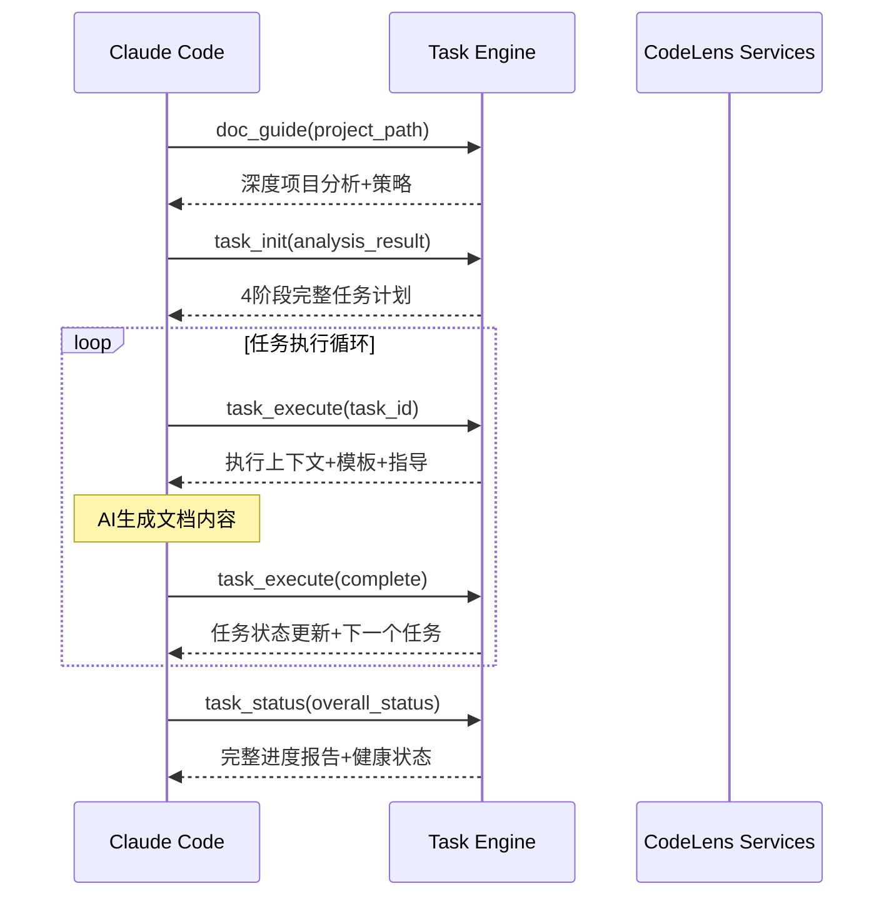

# CodeLens - 智能文档协作平台

## 项目概述

CodeLens 是一个专为Claude Code设计的智能化任务驱动MCP（Model Context Protocol）服务器。通过**五层架构设计**和**5阶段工作流程**，CodeLens为Claude Code提供从项目分析到文档生成的完整智能化协作体验，实现高质量项目文档的自动化生成。支持热重载功能，提供开发时的实时代码更新体验。

## 🚀 核心特性

🏗️ **五层架构设计**：MCP接口层、任务引擎层、热重载系统层、服务层、基础设施层
🧠 **Task Engine智能任务管理**：支持14种任务类型，完整的任务生命周期管理和5阶段流程控制
🔄 **5阶段严格控制**：项目分析→任务规划→任务执行→进度监控→文档验证，100%完成率要求
🎯 **7个专业MCP工具**：涵盖工作流指导、项目分析、任务管理、执行监控的完整工具链
📊 **实时状态跟踪**：支持中断恢复的持久化状态管理和进度监控
🧠 **智能项目分析**：自动识别5种语言、8种框架，生成定制化文档策略
📚 **16个核心模板系统**：四层架构(Architecture/Module/File/Project)覆盖所有文档需求
🔥 **热重载支持**：实时监控代码变化，自动重载模块，无需重启服务
🛠️ **零依赖设计**：核心功能仅使用Python标准库，部署简单

## 快速开始

### 1. 环境要求

- Python 3.9+
- 无外部依赖，使用Python标准库

### 2. 5阶段智能工作流

```bash
# 工作流指导 - 获取完整操作步骤
python src/mcp_tools/init_tools.py /path/to/your/project

# 阶段1: 智能项目分析
python src/mcp_tools/doc_guide.py /path/to/your/project

# 阶段2: 任务计划生成  
python src/mcp_tools/task_init.py /path/to/your/project --analysis-file analysis.json

# 阶段3: 状态监控检查
python src/mcp_tools/task_status.py /path/to/your/project --type current_task

# 阶段4: 任务循环执行
python src/mcp_tools/task_execute.py /path/to/your/project --task-id <task_id> --mode execute

# 阶段5: 文档验证确认
python src/mcp_tools/doc_verify.py /path/to/your/project

# 传统工具 (兼容)
python src/mcp_tools/doc_scan.py /path/to/your/project
```

### 3. 热重载支持

```bash
# 启动MCP服务器 (默认开启热重载)
python mcp_server.py

# 禁用热重载
CODELENS_HOT_RELOAD=false python mcp_server.py

# 手动触发重载
python mcp_server.py reload
```

### 4. 智能化Claude Code协作流程

1. **📋 工作流指导**: Claude Code调用init_tools获取5阶段标准操作步骤
2. **🧠 智能项目分析**: 调用doc_guide进行深度项目分析和策略制定
3. **📋 任务计划生成**: 调用task_init生成5阶段完整任务计划
4. **📊 状态监控检查**: 调用task_status检查进度和健康状态  
5. **⚡ 智能任务执行**: 调用task_execute获取执行上下文和模板信息
6. **✅ 任务完成确认**: 调用task_complete标记任务完成并验证质量
7. **🔍 文档验证确认**: 使用doc_verify验证最终文档体系

## 核心组件分析

### 🏗️ 五层架构系统

**1. MCP接口层 - 7个专业工具**
- **init_tools**: 工作流指导工具，提供标准5阶段操作步骤
- **doc_guide**: 智能项目分析器，自动识别项目类型、框架和生成策略  
- **task_init**: 任务计划生成器，基于分析结果创建5阶段执行计划
- **task_execute**: 任务执行管理器，提供模板、上下文和执行指导
- **task_status**: 状态监控中心，实时进度跟踪和健康诊断
- **task_complete**: 任务完成工具，标记任务完成并验证输出质量
- **doc_scan**: 项目文件扫描工具，智能过滤和结构化数据提取

**2. 任务引擎层 - 智能化任务驱动核心**
- **TaskManager**: 智能任务管理器，支持14种任务类型、依赖关系和优先级调度
- **PhaseController**: 5阶段严格控制器，确保100%完成率的阶段转换
- **StateTracker**: 实时状态跟踪，支持执行历史、性能监控和健康检查

**3. 热重载系统层 - 开发时实时更新支持**
- **HotReloadManager**: 热重载协调管理器，统一管理文件监控和模块重载流程
- **FileWatcher**: 双模式文件监控(watchdog+轮询)，实时检测代码变化
- **ModuleReloader**: 智能模块重载器，支持依赖分析和安全重载

**4. 服务层 - 核心业务逻辑**
- **FileService**: 智能文件分析服务，项目类型检测、框架识别和智能过滤
- **TemplateService**: 模板管理服务，16个核心模板统一管理，四层架构支持
- **ValidationService**: 验证服务，文档结构验证、完整性检查和多种验证模式

**5. 基础设施层 - 底层支撑**
- **文件系统**: 基于pathlib的智能文件操作和过滤
- **模板资源**: 16个核心模板，四层架构(Architecture/Module/File/Project)支持
- **状态存储**: JSON持久化文件系统，支持任务状态和执行历史保存

## 项目状态

🚀 **五层架构 + 热重载系统完成**

**✅ 核心功能特性**:
- ✅ **五层架构设计** - MCP接口层、任务引擎层、热重载系统层、服务层、基础设施层
- ✅ **Task Engine智能管理** - 完整的任务生命周期管理和5阶段流程控制
- ✅ **7个专业MCP工具** - 覆盖工作流指导、项目分析、任务管理、执行监控的完整工具链
- ✅ **热重载系统** - 实时监控代码变化，自动重载模块，支持开发时热更新
- ✅ **智能项目分析** - 自动识别5种语言、8种框架，生成定制化策略
- ✅ **实时状态跟踪** - 支持中断恢复的持久化状态管理
- ✅ **5阶段工作流程** - 项目分析→任务规划→任务执行→进度监控→文档验证的完整闭环
- ✅ **16个核心模板库** - 四层架构覆盖所有文档需求
- ✅ **智能模板服务** - 按层级、类型、名称灵活查询模板
- ✅ **完整MCP服务器** - 生产就绪的协议服务器实现

**🚀 系统优势**:
- 🏗️ **架构清晰**: 五层分离，职责明确，易于维护和扩展
- 🧠 **智能化协作**: 从被动信息提供到主动智能协作
- ⚡ **任务驱动**: 完整的任务生命周期管理和进度跟踪
- 🔥 **热重载**: 开发时实时代码更新，无需重启服务
- 📊 **状态感知**: 实时监控和健康检查机制
- 🔧 **流程标准化**: 5阶段严格依赖验证和100%完成率要求
- 🎯 **上下文增强**: 为AI提供丰富的执行上下文和指导信息

## 技术架构

### 🏗️ 五层架构详细设计

```
🎯 MCP接口层 - 7个专业工具
├── init_tools - 工作流指导工具
├── doc_guide - 智能项目分析器
├── task_init - 任务计划生成器
├── task_execute - 任务执行管理器
├── task_status - 状态监控中心  
├── task_complete - 任务完成工具
└── doc_scan - 项目文件扫描工具

🧠 任务引擎层 - 智能化任务驱动核心
├── TaskManager - 支持14种任务类型、依赖关系和优先级调度
├── PhaseController - 5阶段严格控制器(100%完成率要求)
└── StateTracker - 实时状态跟踪(执行历史、性能监控、健康检查)

🔥 热重载系统层 - 开发时实时更新支持
├── HotReloadManager - 热重载协调管理器
├── FileWatcher - 双模式文件监控(watchdog+轮询)
└── ModuleReloader - 智能模块重载器(依赖分析、安全重载)

🛠️ 服务层 - 核心业务逻辑
├── FileService - 智能文件分析(项目类型检测、框架识别)
├── TemplateService - 16个核心模板管理
└── ValidationService - 文档验证服务

🏗️ 基础设施层 - 底层支撑
├── 文件系统 - 基于pathlib的智能文件操作
├── 模板资源 - 四层架构模板支持
└── 状态存储 - JSON持久化文件系统
```

### 🔄 5阶段严格控制流程

```
Phase 1: 智能项目分析 (doc_guide)
    ↓ 100%完成
Phase 2: 任务计划生成 (task_init)  
    ↓ 100%完成
Phase 3: 状态监控检查 (task_status)
    ↓ 100%完成
Phase 4: 任务循环执行 (task_execute)
    ↓ 100%完成
Phase 5: 文档验证确认 (doc_verify)

每阶段必须100%完成才能进入下一阶段，确保文档质量
```

### 📚 四层模板架构体系 (16个)

```
🏛️ Architecture层 (6个) - 系统概述、技术栈、数据流、组件图、部署图、系统架构
📦 Module层 (6个) - 模块分析、关系图、依赖图、README、API文档、流程文档
📄 File层 (1个) - 详细文件分析，包含流程图、作用域分析、依赖关系
📈 Project层 (3个) - README、变更日志、发展路线
```

### 🔥 热重载技术实现

```
🔍 文件监控 (FileWatcher)
├── watchdog模式 - 高效实时监控(优先)
└── 轮询模式 - 降级备用方案

🔄 模块重载 (ModuleReloader)  
├── 依赖分析 - 自动构建模块依赖关系图
├── 安全重载 - 按正确顺序重载相关模块
└── 缓存清理 - 清除.pyc文件和依赖记录

🎯 协调管理 (HotReloadManager)
├── 事件调度 - 防抖动处理和批量重载
├── 工具刷新 - 自动更新MCP工具实例
└── 生命周期 - 优雅启动和停止机制
```

### 🎯 智能化AI协作工作流
1. **📋 工作流指导**: init_tools提供5阶段标准操作步骤
2. **🧠 深度项目分析**: doc_guide智能识别项目类型、框架、模块特征
3. **📋 智能任务规划**: task_init生成5阶段完整任务计划和依赖图谱
4. **📊 状态监控检查**: task_status全面监控进度和健康状态
5. **⚡ 任务执行驱动**: task_execute提供执行上下文、模板和指导信息
6. **✅ 任务完成确认**: task_complete标记任务完成并验证质量
7. **🔍 完整性验证**: doc_verify确保最终文档体系完整性

## 使用示例

### 🎯 MCP服务器部署

```bash
# 1. 启动CodeLens智能MCP服务器 (默认开启热重载)
python mcp_server.py

# 2. 测试智能工作流功能
python mcp_server.py test /path/to/project

# 3. 查看服务器信息和7个工具
python mcp_server.py info

# 4. 热重载相关操作
python mcp_server.py reload          # 手动触发重载
CODELENS_HOT_RELOAD=false python mcp_server.py  # 禁用热重载
```

### 🔧 Claude Code集成配置

```json
{
  "mcpServers": {
    "codelens": {
      "command": "python",
      "args": ["mcp_server.py"],
      "cwd": "/path/to/codelens",
      "env": {
        "PYTHONPATH": "/path/to/codelens",
        "CODELENS_HOT_RELOAD": "true"
      }
    }
  }
}
```

### 🚀 智能工作流执行示例

```bash
# 完整5阶段工作流演示
📋 Phase 1: 工作流指导 (init_tools)
└── 获取5阶段标准操作步骤和完整工作流程

🧠 Phase 2: 智能项目分析 (doc_guide)  
├── 检测到: Python Flask项目
├── 识别框架: Flask + SQLAlchemy + Jinja2
├── 文件分析: 23个核心Python文件，3个模块
├── 复杂度评估: medium级别
└── 生成策略: 顺序执行，优先关键文件

📋 Phase 3: 任务计划生成 (task_init)
├── 生成任务: 14种任务类型，32个具体任务
├── 依赖关系: 构建任务依赖图谱
├── 优先级排序: 3个高优先级，15个普通，14个低优先级
└── 时间估算: 预计3-4小时完成

⚡ Phase 4: 任务循环执行 (task_execute + task_status)
├── File层文档: 23个文件摘要任务
├── Module层文档: 6个模块分析任务  
├── Architecture层文档: 6个架构设计任务
├── Project层文档: 1个项目总结任务
└── 实时进度: 78.1% (25/32任务完成)

✅ Phase 5: 文档验证确认 (doc_verify)
├── 结构验证: 检查文档目录完整性
├── 文件存在性: 验证32个预期文件
├── 完成度分析: Architecture(100%), Files(95.7%), Project(100%)
└── 质量报告: 31/32文件已生成，1个文件待完成
```

### 🎭 智能化协作流程



## 开发路线图

### Phase 1: 基础架构 ✅
- ✅ 重构为Claude Code协作助手
- ✅ 实现三个核心MCP工具
- ✅ 完善服务层架构
- ✅ 100%测试覆盖率

### Phase 2: 可观测性 ✅
- ✅ **完整日志系统**：结构化日志、异步写入
- ✅ **文件轮转机制**：按大小/时间轮转、自动压缩
- ✅ **监控统计**：操作追踪、性能分析
- ✅ **配置管理**：JSON配置文件、运行时更新

### Phase 3: Task Engine智能化 ✅ 
- ✅ **Task Engine核心**: TaskManager, PhaseController, StateTracker
- ✅ **7个专业MCP工具**: init_tools, doc_guide, task_init, task_execute, task_status, task_complete, doc_scan
- ✅ **5阶段工作流程**: 严格阶段控制和100%完成率要求
- ✅ **智能项目分析**: 自动识别5种语言、8种框架、模块
- ✅ **状态持久化**: 支持中断恢复的完整状态跟踪
- ✅ **实时监控**: 健康检查和性能监控机制

### Phase 4: 热重载系统 ✅
- ✅ **热重载管理器**: HotReloadManager协调管理器
- ✅ **双模式文件监控**: FileWatcher(watchdog+轮询)  
- ✅ **智能模块重载**: ModuleReloader(依赖分析、安全重载)
- ✅ **开发体验**: 实时代码更新，无需重启服务
- ✅ **降级处理**: watchdog不可用时自动切换轮询模式

### Phase 5: 功能增强 (计划中)
- 🔄 增强模板系统，支持自定义模板和变量
- 🔄 并发任务执行优化
- 🔄 Web界面状态监控仪表板

### Phase 6: 生态集成 (规划中)
- 🔜 Claude Code深度集成优化
- 🔜 Docker容器化部署方案
- 🔜 集成CI/CD工作流
- 🔜 多项目并行支持

## 贡献指南

1. Fork 项目
2. 创建特性分支
3. 提交改动
4. 发起Pull Request

## 许可证

[MIT License](LICENSE)