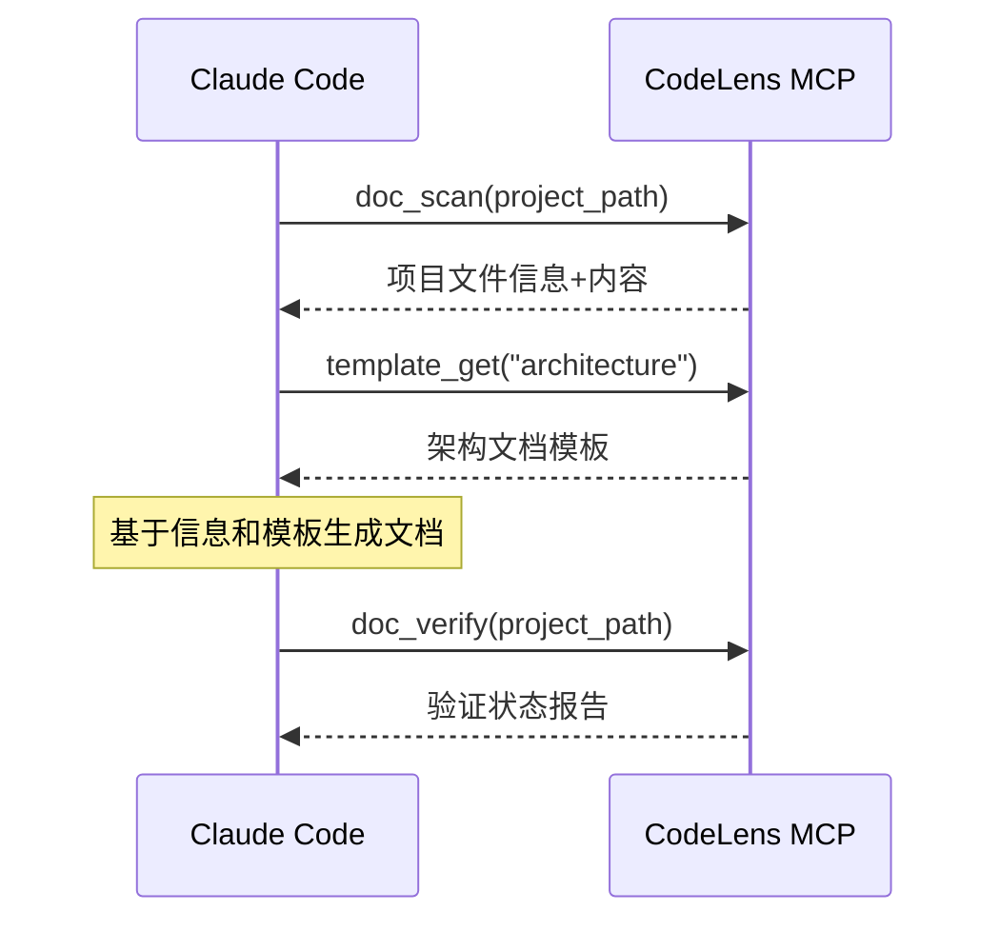

# CodeLens - 文档协作平台

## 项目概述

CodeLens 0.5.1 是一个专为Claude Code设计的MCP（Model Context Protocol）协作服务器。通过四层文档架构和26个专业模板系统，CodeLens为Claude Code提供结构化项目信息、标准化文档模板和完整验证服务，实现高效的项目文档理解与生成。

## 核心特性

📚 **26个专业模板系统**：覆盖架构、模块、文件、项目四个文档层级
📊 **四层文档架构**：系统化的分层文档生成策略
🔧 **模块化模板设计**：独立文件组织，易于维护和扩展
🎯 **Claude Code集成**：专为AI协作优化的信息提供服务
📈 **完整可观测性**：结构化日志、性能监控、文件轮转
🛠️ **零依赖设计**：仅使用Python标准库，部署简单

## 快速开始

### 1. 环境要求

- Python 3.9+
- 无外部依赖，使用Python标准库

### 2. 使用MCP工具

```bash
# 扫描项目文件
python src/mcp_tools/doc_scan.py /path/to/your/project

# 获取文档模板  
python src/mcp_tools/template_get.py --list-all

# 验证文档状态
python src/mcp_tools/doc_verify.py /path/to/your/project
```

### 3. Claude Code协作流程

1. **Claude Code调用doc_scan**获取项目文件信息
2. **Claude Code调用template_get**获取适合的文档模板
3. **Claude Code基于信息和模板生成文档**
4. **Claude Code调用doc_verify**验证生成状态

## 项目状态

**当前版本**: v0.5.1 (26个专业模板系统)

**✅ 核心功能特性**:
- ✅ **专业模板库** - 26个专业模板，满足不同文档需求
- ✅ **智能模板服务** - 按层级、类型、名称灵活查询模板
- ✅ **模板格式化引擎** - 支持变量替换和内容验证  
- ✅ **完整MCP服务器** - 生产就绪的协议服务器实现
- ✅ **三核心MCP工具** - doc_scan, template_get, doc_verify
- ✅ **完整日志系统** - 结构化日志、文件轮转、性能监控

**架构优势**:
- 🎯 专注信息提供，与Claude Code完美协作
- 🚀 无状态设计，每次调用独立执行
- 🔧 模块化架构，各服务组件独立
- 📊 结构化JSON响应，便于解析

## 技术架构

### 🏗️ 四层文档架构体系

CodeLens 0.5.0 创新性地设计了四层文档架构，每层专注特定范围的文档生成：

```
🏛️ 架构层 (Architecture) - 7个模板
├── 系统架构概述、技术栈分析、数据流设计
├── 设计模式、安全架构、部署架构、扩展性分析

🧩 模块层 (Module) - 6个模板  
├── 模块总览、关系分析、依赖图谱
├── 模块文档、API接口、业务流程

📄 文件层 (File) - 5个模板
├── 文件摘要、类分析、函数目录
├── 算法分解、代码度量

📈 项目层 (Project) - 8个模板
├── README、变更日志、发展路线、贡献指南
├── API参考、故障排除、性能报告、版本记录
```

### 🚀 核心服务架构
- **TemplateServiceV05**: 26个专业模板管理，支持按层级/类型/名称查询
- **FileService**: 项目文件信息提取和元数据服务
- **ValidationService**: 文档验证和状态报告服务
- **LoggingService**: 完整日志管理，支持结构化日志、文件轮转和监控

### 🔧 MCP工具层
- **doc_scan**: 扫描项目文件并返回结构化信息
- **template_get**: 获取26个专业模板中的任意模板资源
- **doc_verify**: 验证文档生成状态和结构完整性

### 🎯 AI协作工作流
1. **项目扫描**: Claude Code调用doc_scan获取完整项目信息
2. **模板选择**: 基于需求从26个模板中选择适合的文档模板
3. **智能生成**: Claude Code结合项目信息和模板生成专业文档
4. **质量验证**: 使用doc_verify确保文档结构完整性

## 使用示例

### 🎯 MCP服务器部署

```bash
# 1. 启动MCP服务器
python mcp_server.py

# 2. 测试服务器功能
python mcp_server.py test /path/to/project

# 3. 查看服务器信息
python mcp_server.py info
```

### 🔧 Claude Code集成配置

```json
{
  "mcpServers": {
    "codelens": {
      "command": "python",
      "args": ["mcp_server.py"],
      "cwd": "/path/to/codelens",
      "env": {
        "PYTHONPATH": "/path/to/codelens"
      }
    }
  }
}
```

### 📊 实际测试结果 (微信自动化项目)

```bash
# 扫描结果
📁 发现文件: 118 个
📊 总大小: 1,799,299 字节  
⏱️ 扫描耗时: 0.07 秒
📋 文件类型: {'.md': 84, '.py': 32, '.txt': 1, '.json': 1}

# 生成结果
✅ 项目README: docs/project/README.md
✅ 架构概述: docs/architecture/overview.md  
✅ 文件摘要: 5个核心文件
💯 完成度: 25.0% → minimal状态
```

### 🎭 协作流程示例



## 开发路线图

### Phase 1: 基础架构 ✅
- ✅ 重构为Claude Code协作助手
- ✅ 实现三个核心MCP工具
- ✅ 完善服务层架构
- ✅ 100%测试覆盖率

### Phase 2: 可观测性 ✅
- ✅ **完整日志系统**：结构化日志、异步写入
- ✅ **文件轮转机制**：按大小/时间轮转、自动压缩
- ✅ **监控统计**：操作追踪、性能分析
- ✅ **配置管理**：JSON配置文件、运行时更新

### Phase 3: 功能增强
- 🔄 支持更多文件类型 (JS/TS, Go, Rust等)
- 🔄 增强模板系统，支持自定义模板
- 🔄 改进文件过滤和扫描性能
- 🔄 日志系统Web界面

### Phase 4: 生态集成
- 🔜 开发Claude Code插件
- 🔜 提供MCP服务器部署方案
- 🔜 集成更多IDE和开发工具

## 贡献指南

1. Fork 项目
2. 创建特性分支
3. 提交改动
4. 发起Pull Request

## 许可证

[MIT License](LICENSE)