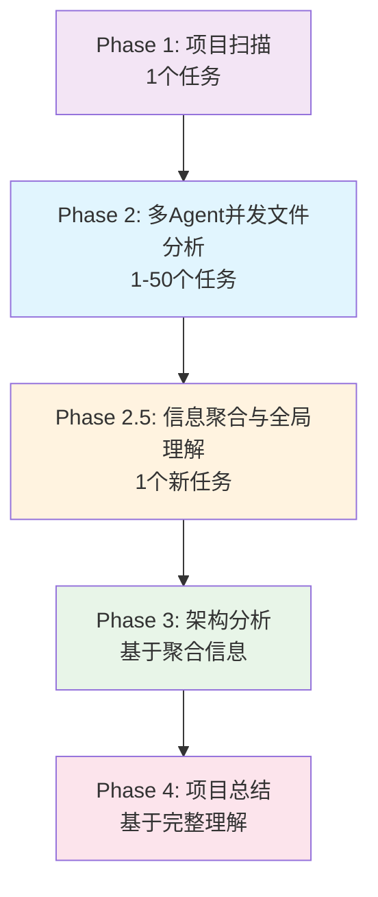

# CodeLens 多Agent并发执行解决方案

## 🎯 问题分析

### 当前架构限制
- **顺序执行瓶颈**: Phase 2文件层任务必须逐一执行，耗时较长
- **信息孤岛问题**: 多Agent并发执行会导致各Agent缺乏全局视野
- **质量风险**: Phase 3/4架构和项目层文档可能因信息不完整而质量下降

### 核心挑战
1. **依赖管理**: 如何在保证依赖正确性的前提下实现并发
2. **信息整合**: 如何让多Agent的分散分析结果形成完整的项目理解
3. **质量保证**: 如何确保后续阶段的文档生成不受并发影响

## 🚀 解决方案设计

### 方案概述：5阶段智能工作流



### 核心创新点

#### 🔄 **Phase 2: 无依赖并发执行**
- 移除文件层任务间的人工依赖
- 多个Claude Code实例同时执行`task_execute`
- 每个Agent独立分析单个文件
- 生成标准化的文件分析文档

#### 🧠 **Phase 2.5: 信息聚合任务（关键创新）**
- **新任务类型**: `PROJECT_INTEGRATION`
- **执行时机**: 所有文件层任务完成后
- **核心职责**: 
  1. 读取所有已生成的文件文档
  2. 建立文件间关系图谱  
  3. 识别模块依赖和调用关系
  4. 生成项目全局理解报告
  5. 为Phase 3提供完整上下文

## 🛠️ 技术实现方案

### 1. 任务类型扩展

#### 添加新任务类型
```python
class TaskType(Enum):
    """任务类型枚举"""
    SCAN = "scan"  # 项目扫描
    FILE_SUMMARY = "file_summary"  # 文件摘要生成
    PROJECT_INTEGRATION = "project_integration"  # 🆕 项目信息聚合（Phase 2.5）
    ARCHITECTURE = "architecture"  # 架构概述
    TECH_STACK = "tech_stack"  # 技术栈
    # ... 其他任务类型
```

### 2. 阶段控制器更新

#### 支持Phase 2.5
```python
class Phase(Enum):
    """阶段枚举"""
    PHASE_1_SCAN = "phase_1_scan"
    PHASE_2_FILES = "phase_2_files" 
    PHASE_2_5_INTEGRATION = "phase_2_5_integration"  # 🆕 信息聚合阶段
    PHASE_3_ARCHITECTURE = "phase_3_architecture"
    PHASE_4_PROJECT = "phase_4_project"
```

### 3. 任务依赖重构

#### 原依赖结构
```
Phase 1: scan_task_1
    ↓
Phase 2: file_task_1, file_task_2, ..., file_task_N (依赖scan_task_1)
    ↓ 
Phase 3: arch_task_1, arch_task_2, ... (依赖所有file_task)
    ↓
Phase 4: project_task_1, ... (依赖所有arch_task)
```

#### 新依赖结构
```
Phase 1: scan_task_1
    ↓
Phase 2: file_task_1, file_task_2, ..., file_task_N (仅依赖scan_task_1) ← 🚀 可并发
    ↓
Phase 2.5: integration_task_1 (依赖所有file_task) ← 🎯 信息聚合
    ↓
Phase 3: arch_task_1, arch_task_2, ... (依赖integration_task_1) ← ✅ 基于完整信息
    ↓  
Phase 4: project_task_1, ... (依赖所有arch_task)
```

### 4. 任务生成逻辑

#### 修改task_init.py
```python
def _generate_phase_2_5_tasks(self, project_path: str, phase_2_tasks: List[Dict]) -> List[Dict[str, Any]]:
    """生成Phase 2.5信息聚合任务"""
    
    # 收集所有file_summary任务ID作为依赖
    file_task_ids = [task["id"] for task in phase_2_tasks if task["type"] == "file_summary"]
    
    integration_task = {
        "id": f"integration_{int(time.time() * 1000)}",
        "type": "project_integration",
        "description": "聚合分析所有文件文档，建立项目全局理解",
        "phase": "phase_2_5_integration",
        "template": "project_integration",
        "output_path": "docs/integration/project_analysis.md",
        "dependencies": file_task_ids,  # 依赖所有文件任务
        "priority": "high",
        "estimated_time": "10 minutes",
        "metadata": {
            "aggregates_files": len(file_task_ids),
            "integration_type": "full_project_analysis"
        }
    }
    
    return [integration_task]
```

### 5. 模板系统扩展

#### 新增project_integration模板
```python
PROJECT_INTEGRATION_TEMPLATE = """# 项目信息聚合分析报告

## 项目全局概览

### 文件分析汇总
{file_analysis_summary}

### 模块依赖关系图
```mermaid
graph TD
{dependency_graph}
```

### 核心架构模式识别
{architecture_patterns}

### 关键文件重要性排序
{file_importance_ranking}

### 技术栈确认
{tech_stack_confirmation}

### 为后续阶段提供的关键信息
{key_insights_for_next_phases}

## 架构设计建议
{architecture_recommendations}

## 文档生成指导
{documentation_guidance}
"""
```

### 6. 执行器增强

#### task_execute.py支持新任务类型
```python
def _execute_integration_task(self, task_id: str) -> Dict[str, Any]:
    """自动执行项目信息聚合任务"""
    
    # 1. 读取所有文件文档
    file_docs = self._read_all_file_documents()
    
    # 2. 分析文件间关系
    file_relationships = self._analyze_file_relationships(file_docs)
    
    # 3. 建立依赖图谱
    dependency_graph = self._build_dependency_graph(file_relationships)
    
    # 4. 生成聚合报告
    integration_report = self._generate_integration_report(
        file_docs, file_relationships, dependency_graph
    )
    
    # 5. 保存报告
    output_path = self.project_path / task.output_path
    with open(output_path, 'w', encoding='utf-8') as f:
        f.write(integration_report)
    
    # 6. 完成任务
    self.task_manager.update_task_status(task_id, TaskStatus.COMPLETED)
    
    return {"success": True, "integration_completed": True}
```

## 📋 实施计划

### Phase 1: 基础架构修改
1. **任务类型扩展**: 添加`PROJECT_INTEGRATION`任务类型
2. **阶段控制器更新**: 支持Phase 2.5
3. **模板系统扩展**: 新增信息聚合模板

### Phase 2: 任务生成逻辑
1. **修改task_init.py**: 生成Phase 2.5任务
2. **重构依赖关系**: 移除文件任务间依赖
3. **更新阶段转换**: 确保正确的阶段控制

### Phase 3: 执行器增强  
1. **扩展task_execute.py**: 支持信息聚合任务
2. **实现聚合算法**: 文件关系分析和依赖图构建
3. **优化上下文构建**: 为后续阶段提供丰富上下文

### Phase 4: 测试验证
1. **并发测试**: 验证多Agent并发执行的正确性
2. **质量测试**: 确保后续文档质量不受影响
3. **性能测试**: 评估整体性能提升效果

## 🎯 预期效果

### 性能提升
- **文件层任务**: 从串行执行改为并发执行，速度提升3-5倍
- **总体耗时**: 大型项目文档生成时间从3小时缩减至1小时
- **资源利用**: 充分利用多Agent并发能力

### 质量保证
- **信息完整性**: Phase 2.5确保所有文件信息被充分整合
- **架构准确性**: 基于完整项目理解的架构分析
- **文档一致性**: 统一的项目视角和技术栈理解

### 用户体验
- **并发友好**: 支持多个Claude Code实例同时工作
- **进度透明**: 实时监控各阶段执行进度
- **质量可控**: 自动验证和质量检查机制

## 🔧 兼容性考虑

### 向后兼容
- 现有4阶段工作流保持兼容
- 可通过配置选择是否启用Phase 2.5
- 单Agent执行模式仍然支持

### 渐进升级
- 可以分步骤实施，先实现基础功能
- 支持混合模式：部分并发 + 部分串行
- 保留现有任务执行机制作为备选

## 💡 进阶优化

### 智能任务分组
```python
# 按文件关联度分组，同组内并发执行
def group_related_files(files: List[str]) -> List[List[str]]:
    """将相关文件分组以优化并发执行"""
    # 实现文件关联度分析和智能分组
```

### 动态负载均衡
```python
# 根据Agent负载动态分配任务
def dynamic_task_allocation(agents: List[Agent], tasks: List[Task]) -> Dict[Agent, List[Task]]:
    """动态分配任务到可用Agent"""
    # 实现负载均衡算法
```

### 增量信息聚合
```python
# 支持增量文档更新时的快速重聚合
def incremental_integration(changed_files: List[str]) -> IntegrationResult:
    """增量模式下的信息聚合"""
    # 只重新分析变更文件及其影响
```

## 📊 监控指标

### 性能指标
- 文件任务并发度（同时执行的任务数）
- 阶段完成时间对比
- 资源利用率（CPU、内存、网络）

### 质量指标  
- 信息聚合完整性评分
- 后续阶段文档质量评估
- 依赖关系识别准确率

### 用户体验指标
- 总体文档生成时间
- 错误率和重试次数
- 用户满意度反馈

---

**总结**: 此解决方案通过引入Phase 2.5信息聚合阶段，巧妙地解决了多Agent并发执行与信息完整性之间的矛盾，在大幅提升性能的同时保证了文档质量，为CodeLens项目提供了一个可行且高效的并发执行架构。